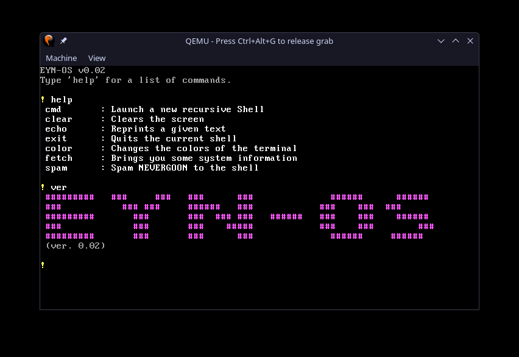

# EYN-OS

It's here. Well, a bit of it at least.

It's mostly unfinished, but there's a kernel and it can print to the screen using C. Basically, you can now add C code to the OS to make it do what you want, all the hard work is done (other than drivers).

---

### To build:

To build it, you just need to change to the EYN-OS directory and type 'make build-x86_64'. Then, run the 'kernel.iso' in '/dist/x86/' with QEMU to boot the OS in a virtual machine.

### What we have so far:

It's not much, but consider what it takes to do this. A kernel, custom print statement, many, many lines of assembly and C integration.
It's quite impressive for a kid's weekend project, if you ask me.

---

EYN-OS, by Kian Gentry, with assistance from Finley Martin.