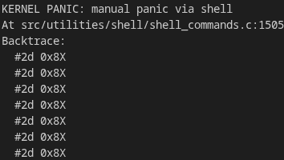

# EYN-OS Quick Debugging Reference Card

## When Things Go Wrong

### 1. System Panics (Blue Screen)
```
Stop Code: EYNOS_XXXXXXXX
Category: [ASSERT|PAGING|FILESYSTEM|IRQ|GENERAL]
```

**Immediate Actions**:
1. Note the stop code and category
2. Capture serial output (COM1)
3. Check `docs/stop-codes.md` for your category
4. Run with `make qemu-debug` to see serial log

**Common Categories**:
- **ASSERT** → Logic error, check assertion condition
- **PAGING** → Memory error (null pointer, overflow)
- **FILESYSTEM** → Disk corruption, run `fscheck` or `make eynfsimg`
- **IRQ** → Interrupt issue, check IDT initialization
- **GENERAL** → Other (watchdog timeout, etc.)

---

### 2. System Hangs (No Panic)

**Check**:
- Serial output for last message
- Watchdog timeout (should trigger after ~2.5s)
- Recent code that might loop infinitely



**Debug**:
```bash
# GDB: Ctrl+C to break, then:
(gdb) backtrace
(gdb) print $eip
```

**Common Causes**:
- Infinite loop without `watchdog_kick()`
- Interrupts disabled (`cli` without `sti`)
- Waiting for hardware that never responds

---

### 3. Network Issues

| Problem | Check | Fix |
|---------|-------|-----|
| "No e1000 device" | `pciscan net` | Verify QEMU: `-device e1000` |
| "ARP timeout" | Destination IP | Use 10.0.2.x in QEMU |
| "Queue full" | `e1000 udp-stats` | `e1000 udp-drain` |
| No packets | `e1000 regs` | Check STATUS bit 1 (link) |

**Debug Commands**:
```bash
e1000 init            # Initialize NIC
e1000 regs            # Check registers
e1000 udp-stats       # Check packet counts
e1000 udp-drain       # Clear queue
```

---

### 4. Filesystem Errors

| Problem | Check | Fix |
|---------|-------|-----|
| "Magic mismatch" | Wrong partition | `fdisk`, verify LBA 2048 |
| File not found | CWD | `ls`, check path |
| Corruption | Integrity | `fscheck` or rebuild |

**Rebuild Disk**:
```bash
# On host
make eynfsimg
make run
```

**Check Filesystem**:
```bash
# In EYN-OS
init
fscheck

# On host
python3 devtools/fsck_eynfs.py eynfs.img
```

---

### 5. Memory Issues

**Symptoms**:
- Heap corruption panic
- Random crashes
- "Invalid magic" assertions

**Debug**:
```bash
memory stats          # Check heap health
memory test           # Run tests
```

**In GDB**:
```gdb
(gdb) x/100x 0x00200000    # Examine heap
(gdb) watch *(int*)address # Watch for changes
```

**Common Causes**:
- Buffer overflow (write past allocation)
- Double free (same pointer freed twice)
- Use after free (access freed memory)

---

### 6. UELF/Userspace Crashes

**Symptoms**:
- Segmentation fault in user program
- Invalid syscall
- Stack overflow

**Debug**:
```bash
# Test basic ring-3:
ring3 yes

# Try simple program:
run hello.uelf

# Check ELF format:
file testdir/program.uelf  # On host
```

**Common Issues**:
- Wrong linker script (use `devtools/user_elf32.ld`)
- Invalid syscall number
- Stack too small (increase in linker script)
- Bad entry point

---

## Essential Debug Commands

### In EYN-OS Shell
```bash
init              # Initialize system
memory stats      # Heap status
schedstat         # Scheduler MLFQ snapshot
e1000 init        # Start network
e1000 regs        # NIC registers
e1000 udp-stats   # Network stats
fscheck           # Filesystem check
pciscan net       # List PCI devices
lsata             # List ATA drives
panic             # Test panic screen
assertfail yes    # Test assertions
```

### On Host
```bash
make qemu-debug   # Run with serial output
make qemu-gdb     # Run with GDB support
make eynfsimg     # Rebuild disk image

# Filesystem tools
python3 devtools/fsck_eynfs.py eynfs.img
python3 devtools/extract_from_eynfs.py eynfs.img out/

# GDB connection
gdb tmp/boot/kernel.bin
(gdb) target remote :1234
```

---

## GDB Quick Commands

```gdb
# Breaking
break main
break e1000_init
break panic

# Stepping
step              # Into functions
next              # Over functions
continue          # Resume

# Inspection
backtrace         # Call stack
info registers    # CPU state
print variable
print/x value     # Hex
x/10x $esp        # Memory at stack

# Useful breakpoints
break panic
break assert_fail
watch *(int*)0x12345678  # Memory watchpoint
```

---

## Serial Debug Output

**Enable**:
```bash
make qemu-debug   # Stdout
# or
qemu-system-i386 -kernel kernel.bin -serial file:debug.log
```

**What to look for**:
- Panic backtraces (most important!)
- Initialization messages
- Driver status
- Last message before hang
- Watchdog kicks

**Add to code**:
```c
#include <serial.h>

serial_write(SERIAL_COM1, "[DEBUG] Checkpoint\n", 19);

char buf[64];
snprintf(buf, sizeof(buf), "Value: %d\n", value);
serial_write(SERIAL_COM1, buf, strlen(buf));
```

---

## Component-Specific Debugging

### E1000 NIC
- **File**: `src/drivers/e1000.c`
- **Registers**: `e1000 regs` command
- **Test**: `e1000 test --expect-link up`
- **Key register**: STATUS (0x0008), bit 1 = link up

### Network Stack
- **File**: `src/network/netstack.c`
- **Stats**: `e1000 udp-stats`, `e1000 udp-drain`
- **Enable debug**: Set `NET_DEBUG 1` in source
- **Check**: ARP cache, packet queues

### Heap
- **File**: `src/mm/heap.c`
- **Check**: Magic numbers (0xDEADBEEF)
- **Command**: `memory stats`
- **Watch for**: Corruption, leaks, fragmentation

### Paging
- **File**: `src/mm/vmm.c`, `src/mm/paging_compat.c`
- **Check**: CR2 register (fault address)
- **Map**: 0x00400000 = user code start
- **Watch for**: Null pointer (0x0), stack overflow
- **Note**: Many user-mode non-present faults are expected (demand paging / swap-in) and may be handled silently for performance.

### Filesystems
- **EYNFS**: `src/fs/eynfs.c`, magic 0x454E5946
- **FAT32**: `src/fs/fat32.c`
- **Commands**: `fscheck`, `fdisk`, `lsata`
- **Tools**: `devtools/fsck_eynfs.py`

---

## Panic Stop Code Examples

| Code | Category | Meaning | Check |
|------|----------|---------|-------|
| Any | ASSERT | Assertion failed | Source line, condition |
| Any | PAGING | Unhandled page fault | CR2 address, backtrace |
| Any | WATCHDOG | Hang detected | Last kick context |
| Any | IRQ | Interrupt error | IDT, handler, EOI |

**Full stop code list**: `docs/stop-codes.md`

---

## Emergency Recovery

### System won't boot
1. Rebuild kernel: `make clean && make build`
2. Rebuild disk: `make eynfsimg`
3. Test in QEMU: `make run`
4. Check GRUB config if booting from ISO

### Filesystem corrupted
```bash
# Rebuild from scratch
make eynfsimg
# or
python3 devtools/create_partitioned_disk.py eynfs.img 10
python3 devtools/copy_testdir_to_eynfs.py eynfs.img testdir/
```

### Can't debug
1. Check serial output works: `make qemu-debug`
2. Try GDB: `make qemu-gdb`
3. Add printf statements and rebuild
4. Binary search: disable features until it works

---

## Documentation Quick Links

- **Stop Codes**: `docs/stop-codes.md`
- **Debugging Guide**: `docs/general/debugging.md`
- **Component Reference**: `docs/general/component-reference.md`
- **Network Stack**: `docs/network/network-stack.md`
- **E1000 Driver**: `docs/network/e1000-driver.md`
- **UELF Format**: `docs/api/userland-uelf-abi.md`
- **Watchdog**: `docs/general/watchdog.md`

---

## Best Practices

**DO**:
- Log to serial in addition to console
- Add `watchdog_kick()` in long loops
- Validate pointers before dereferencing
- Check array bounds
- Return errors instead of panicking when possible
- Test incrementally

**DON'T**:
- Panic on user input errors
- Forget to free allocated memory
- Assume pointers are valid
- Disable interrupts without restoring
- Write code without testing it first

---

**Remember**: Serial output (COM1) is your best friend! Always run with `make qemu-debug` when debugging.
