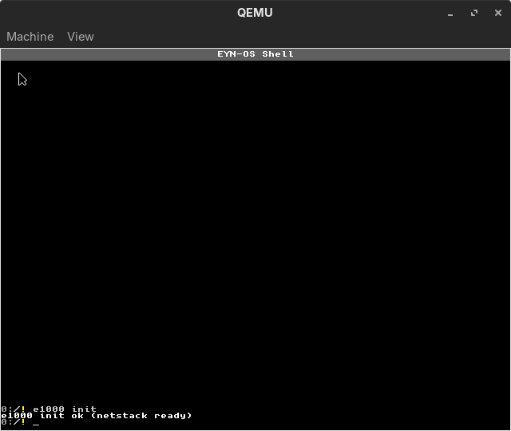
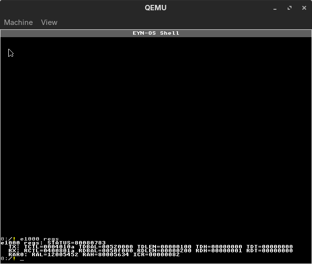
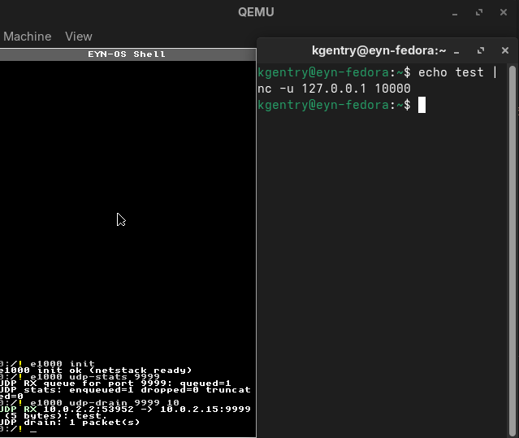

# Network Shell Commands

EYN-OS provides several shell commands for network operations and diagnostics.

## E1000 NIC Commands

### e1000 init
Initialize the Intel e1000 network interface card.

```bash
e1000 init
```

**What it does**:
1. Detects e1000 device via PCI enumeration
2. Enables bus mastering
3. Reads MAC address from EEPROM
4. Performs software reset
5. Allocates TX/RX descriptor rings
6. Configures receiver and transmitter
7. Enables the NIC

**Output**:
```
E1000: Found device at PCI 00:03.0
E1000: MAC address: 52:54:00:12:34:56
E1000: Link is UP
E1000: Initialized successfully
```



**Troubleshooting**:
- "No e1000 device found": NIC not present (check QEMU config)
- "Initialization failed": Check PCI access or memory allocation

---

### e1000 probe
Scan for e1000 device and display basic info (read-only).

```bash
e1000probe
```

**Output**:
```
E1000 Probe Results:
  PCI: 00:03.0
  Vendor: 8086 Device: 100E
  MMIO Base: 0xFEBC0000
  MAC: 52:54:00:12:34:56
  Link: UP
```

---

### e1000 regs
Dump key e1000 register values for debugging.

```bash
e1000 regs
```

**Output**:
```
E1000 Registers:
  CTRL:   0x00040248
  STATUS: 0x80080783 (Link UP)
  RCTL:   0x04008002
  TCTL:   0x0004010A
  RDH:    5  RDT: 4
  TDH:    2  TDT: 2
```



---

### e1000 test
Run diagnostic tests on e1000 device.

```bash
# Basic test
e1000 test

# Test with expected link state
e1000 test --expect-link up

# Test with expected MAC address
e1000 test --expect-mac 52:54:00:12:34:56
```

**Tests**:
- Register access (read/write)
- Link status verification
- MAC address validation
- (Future: loopback test)

---

## PCI Commands

### pciscan
Enumerate PCI devices on the system.

```bash
pciscan
```

**Output**:
```
PCI Devices Found:
  00:00.0 - 8086:1237 (Host Bridge)
  00:01.0 - 8086:7000 (ISA Bridge)
  00:01.1 - 8086:7010 (IDE Controller)
  00:01.3 - 8086:7113 (Power Management)
  00:02.0 - 1234:1111 (VGA Controller)
  00:03.0 - 8086:100E (Ethernet Controller) [e1000]
```

**Tip**: e1000 usually shows as `8086:100E`.

To filter to likely networking devices:
```bash
pciscan net
```

---

## UDP Commands (e1000)

### e1000 udp-listen
Listen for incoming UDP packets on a specified port.

```bash
e1000 udp-listen [local_port] [local_ip] [count] [spins]
```

**Arguments**:
- `<port>`: Port number (0-65535)

**Example**:
```bash
e1000 udp-listen 9999
```

**Behavior**:
- Blocks until packet received or Ctrl+C pressed
- Polls for packets every 10ms
- Kicks watchdog to prevent hang detection
- Displays received packet details

**Output (on packet received)**:
```
UDP packet received:
  From: 10.0.2.2:5000
  To: 10.0.2.15:9999
  Length: 12 bytes
  Data: Hello World!
```


**Testing from host**:
```bash
# With Makefile `make run` (QEMU user-net with hostfwd UDP 10000 -> guest 9999):
echo "test message" | nc -u 127.0.0.1 10000
```

**Notes**:
- QEMU user-mode networking forwards localhost ports to guest
- Default QEMU network: Host=10.0.2.2, Guest=10.0.2.15
- Press Ctrl+C to stop listening

---

### e1000 udp-send
Send a UDP packet to a remote host.

```bash
e1000 udp-send <dst_ip> <dst_port> <message> [src_ip] [src_port] [arpspins]
```

**Arguments**:
- `<ip>`: Destination IPv4 address (dotted decimal)
- `<port>`: Destination port number
- `<message>`: Text message to send (rest of command line)

**Example**:
```bash
e1000 udp-send 10.0.2.2 5000 Hello from EYN-OS
```

**What it does**:
1. Performs ARP lookup for destination IP
   - Sends ARP request if not cached
   - Waits for ARP reply
2. Constructs UDP packet with message
3. Wraps in IPv4 packet
4. Wraps in Ethernet frame
5. Transmits via e1000

**Output**:
```
ARP: Looking up 10.0.2.2...
ARP: Resolved to 52:54:00:12:34:56
UDP: Sent 17 bytes to 10.0.2.2:5000
```

**Common destinations**:
- `10.0.2.2`: QEMU host (in user-mode networking)
- `10.0.2.3`: QEMU DNS (if enabled)

---

### e1000 tcp-send
Establish a TCP connection, send a payload, then close.

```bash
e1000 tcp-send <dst_ip> <dst_port> <message> [src_port] [spins]
```

**Example**:
```bash
# Host:
nc -l 9999

# Guest:
e1000 tcp-send 10.0.2.2 9999 hello
```

**Notes**:
- Minimal TCP client (SYN → SYN-ACK → ACK → data → FIN)
- No retransmits beyond ARP retry
- Payload is a single token (no spaces)

---

### e1000 tcp-listen
Listen for a single TCP connection and accept it.

```bash
e1000 tcp-listen <port>
```

**Example**:
```bash
# Guest:
e1000 tcp-listen 9999

# Host:
# With Makefile `make run` hostfwd: host TCP 10000 -> guest 9999
nc 127.0.0.1 10000
```

---

### e1000 tcp-recv
Receive a queued TCP payload (non-blocking).

```bash
e1000 tcp-recv
```

**Example**:
```bash
e1000 tcp-recv
```

---

### e1000 tcp-sendcur
Send a payload on the current established TCP connection (no new connect).

```bash
e1000 tcp-sendcur <message>
```

**Example**:
```bash
# After a connection is established:
e1000 tcp-sendcur hello
```

---

### e1000 tcp-close
Close the current TCP connection (sends FIN if established).

```bash
e1000 tcp-close
```

---

### e1000 udp-stats
Display UDP statistics.

```bash
e1000 udp-stats
```

**Output**:
```
UDP Statistics:
  RX Packets:      42
  TX Packets:      15
  RX Dropped:      0
  Bad Checksums:   0
  Queue Usage:     2/8
```



**Fields**:
- **RX Packets**: Total packets received
- **TX Packets**: Total packets sent
- **RX Dropped**: Packets dropped (queue full)
- **Bad Checksums**: Packets with invalid checksums
- **Queue Usage**: Current receive queue usage

---

### e1000 udp-drain
Clear the UDP receive queue.

```bash
e1000 udp-drain
```

**Output**:
```
UDP: Drained 3 packets from queue
```

**Use cases**:
- Clear old packets before listening
- Reset state after testing
- Free receive buffers

---

### e1000 udp-bind
Bind a UDP port and create a socket for receiving packets.

```bash
e1000 udp-bind <port>
```

**Example**:
```bash
e1000 udp-bind 9999
# Output: Bound port 9999 → socket 0
```

**What it does**:
- Reserves the specified port
- Creates a dedicated receive queue for that port
- Returns a socket ID for subsequent operations

**Error codes**:
- Negative: Port already bound or no free socket slots
- Up to 8 sockets can be bound simultaneously

---

### e1000 udp-recv
Receive a packet from a bound socket (non-blocking).

```bash
e1000 udp-recv <socket_id>
```

**Example**:
```bash
e1000 udp-recv 0
# Output: Received from 10.0.2.2:12345 (13 bytes): Hello, world!
# Or: No packet
```

**What it does**:
- Checks the socket's receive queue
- Returns immediately (non-blocking)
- Displays source IP, port, and payload

**Use cases**:
- Poll for incoming packets
- Drain socket queue
- Test UDP reception

---

### e1000 udp-close
Close a bound socket and free its port.

```bash
e1000 udp-close <socket_id>
```

**Example**:
```bash
e1000 udp-close 0
# Output: Socket 0 closed
```

**What it does**:
- Unbinds the port
- Clears the socket's receive queue
- Frees the socket slot for reuse

---

## Network Initialization Workflow

Typical startup sequence:

```bash
# 1. Initialize system
init

# 2. Scan PCI to verify NIC present
pciscan net

# 3. Initialize e1000 NIC
e1000 init

# 4. Test connectivity (ICMP echo)
ping 10.0.2.2

# 5. Send a UDP packet to the host
e1000 udp-send 10.0.2.2 5000 Hello
```

---

## Network Testing Examples

### Echo Server (Simple)
```bash
# In EYN-OS:
e1000 udp-echo 9999

# On the host (with Makefile hostfwd UDP 10000 -> guest 9999):
echo "test" | nc -u 127.0.0.1 10000
```

### Send/Receive Test
```bash
# EYN-OS side:
e1000 init
e1000 udp-listen 9999

# Host side:
nc -u 127.0.0.1 10000
echo "hello" and press Enter
```

### Statistics Monitoring
```bash
# Send some packets
e1000 udp-send 10.0.2.2 5000 test1
e1000 udp-send 10.0.2.2 5000 test2
e1000 udp-send 10.0.2.2 5000 test3

# Check stats
e1000 udp-stats
```

---

## Troubleshooting

### "No e1000 device found"
- **Cause**: NIC not present or not detected
- **Fix**: Check QEMU command includes e1000 device
- **QEMU**: `-netdev user,id=net0 -device e1000,netdev=net0`

### "ARP timeout"
- **Cause**: Destination not responding to ARP
- **Fix**: Check IP address is reachable (usually 10.0.2.x in QEMU)
- **Debug**: Use `e1000 regs` to check if receiver enabled

### "UDP: Queue full"
- **Cause**: Receive queue overflow (8 packets max)
- **Fix**: Call `e1000 udp-drain` to clear queue
- **Future**: Increase queue size or process packets faster

### "Link is DOWN"
- **Cause**: NIC not properly initialized or no link
- **Fix**: 
  - Try `e1000 init` again
  - Check `e1000 regs` for STATUS register
  - Verify QEMU network configuration

### "Command not found" (net commands)
- **Cause**: Streaming commands not loaded
- **Fix**: Run `load`, then `status` to verify

---

## Configuration

### Default Network Settings
Defaults match QEMU user-mode networking (slirp). Runtime configuration is available via `netcfg`:

```bash
netcfg show
netcfg set ip 10.0.2.15
netcfg set gw 10.0.2.2
netcfg set mask 255.255.255.0
netcfg set dns 10.0.2.3

# Validate configuration
netcfg verify

# Show whether traffic to a destination goes direct or via gateway
netcfg route 8.8.8.8

# Set-and-persist in one step
netcfg set ip 10.0.2.15 --save

# Persist configuration (default path is /config/net.cfg)
netcfg save
# Or manually load a file (also loaded automatically on `init`)
netcfg load
```

Persisted network configuration is stored as a small text file with `key=value` lines. The default path is `/config/net.cfg` (with a fallback of `/net.cfg`).

### QEMU User-Mode Networking
Default QEMU network topology:
```
Host:     10.0.2.2  (accessible from guest)
Gateway:  10.0.2.2
DNS:      10.0.2.3
Guest:    10.0.2.15 (EYN-OS)
```

Port forwarding (host → guest):
```bash
qemu-system-i386 ... -netdev user,id=net0,hostfwd=udp::10000-:9999
# Now host UDP port 10000 forwards to EYN-OS UDP port 9999
```

---

## Performance Tips

1. **Minimize ARP requests**: Packets to same host use cached MAC
2. **Batch operations**: Send multiple packets without delay
3. **Clear queue**: Use `e1000 udp-drain` before important receive operations
4. **Monitor stats**: Check `e1000 udp-stats` for dropped packets

---

## Related Documentation

- [E1000 Driver](e1000-driver.md) - NIC driver internals
- [Network Stack](network-stack.md) - Protocol implementation
- [Syscalls](../api/syscalls.md) - Future: network syscalls for userland
- [Command Reference](../command-reference.md) - All shell commands

---

## Command Summary

| Command | Purpose | Example |
|---------|---------|---------|
| `e1000 init` | Initialize NIC | `e1000 init` |
| `e1000 probe` | Probe NIC | `e1000probe` |
| `e1000 regs` | Dump registers | `e1000 regs` |
| `e1000 test` | Run diagnostics | `e1000 test --expect-link up` |
| `pciscan` | List PCI devices | `pciscan net` |
| `e1000 udp-listen` | Receive packets | `e1000 udp-listen 9999` |
| `e1000 udp-send` | Send packet | `e1000 udp-send 10.0.2.2 5000 msg` |
| `e1000 udp-stats` | Show statistics | `e1000 udp-stats` |
| `e1000 udp-drain` | Clear queue | `e1000 udp-drain` |
| `netcfg` | Configure network | `netcfg save` |

Additional commands:
- `ping 10.0.2.2`
- `netstat`
- `netcfg show`
- `netcfg save`
- `netcfg load`
