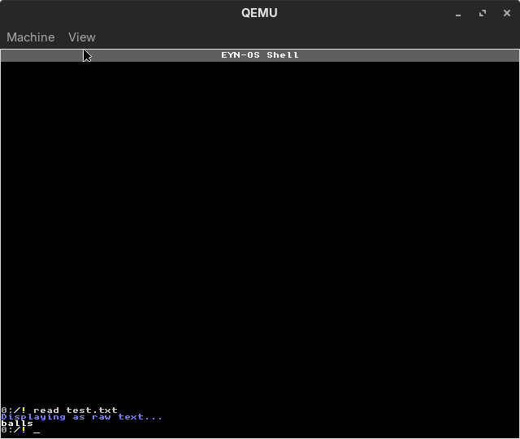
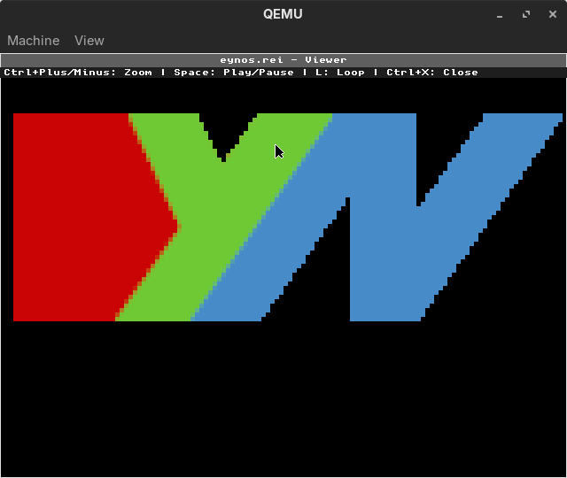

# EYN-OS Quick Reference

A quick reference guide for EYN-OS commands, features, and common operations.

## Getting Started

### Boot Process
1. **GRUB Menu**: Select EYN-OS from boot menu
2. **Kernel Load**: System initializes drivers and filesystem with dynamic memory detection
3. **Shell Ready**: Command prompt appears: `0:/!`

### Basic Navigation
```bash
ls              # List files and directories
cd <dir>        # Change directory
cd ..           # Go to parent directory
cd /            # Go to root directory
clear           # Clear screen
```

## Streaming Command System

### Essential Commands (Always Available)
```bash
init            # Initialize full system services
ls              # List directory contents
exit            # Exit EYN-OS
clear           # Clear screen
help            # Show interactive help
memory          # Memory management
portable        # Portability information
load            # Load streaming commands
unload          # Unload streaming commands
status          # Show command loading status
```

### Loading Streaming Commands
```bash
load            # Load all streaming commands into RAM
unload          # Unload commands to free memory
status          # Check which commands are loaded
```

## Filesystem Commands

| Command | Description | Example |
|---------|-------------|---------|
| `ls` | List directory contents | `ls /games` |
| `cd` | Change directory | `cd /games` |
| `del` | Delete file | `del test.txt` |
| `deldir` | Delete directory | `deldir old_dir` |
| `makedir` | Create directory | `makedir new_dir` |
| `read` | Display text or markdown | `read config.txt` |
| `read_raw` | Raw file display | `read_raw data.bin` |
| `read_md` | Markdown display | `read_md doc.md` |
| `view`/`vieww` | REI image viewer | `view logo.rei` / `vieww logo.rei` |
| `write` | Edit file | `write document.txt` |
| `copy` | Copy file | `copy source.txt dest.txt` |
| `move` | Move file | `move file.txt /backup/` |
| `format` | Format drive | `format 0` |
| `fdisk` | Disk partitioning | `fdisk` |
| `fscheck` | Check filesystem | `fscheck` |

## System Commands

| Command | Description | Example |
|---------|-------------|---------|
| `drive` | Switch disk drive | `drive 1` |
| `lsata` | List ATA drives | `lsata` |
| `pciscan` | PCI device scan | `pciscan net` |
| `ver` | Show version (with REI logo if available) | `ver` |
| `help` | Show help | `help` |
| `history` | Show command history | `history` |
| `alias` | Create command alias | `alias ll ls -la` |
| `exit` | Exit EYN-OS | `exit` |

## Development Tools

| Command | Description | Example |
|---------|-------------|---------|
| `assemble` | Assemble code | `assemble test.asm test.eyn` |
| `run` | Execute program | `run program.eyn` or `run program.uelf` |
| `ring3` | Test ring-3 stub | `ring3 yes` |
| `chibicc` | C compiler | `chibicc hello.c -o hello.uelf` |
| `calc` | Calculator | `calc 2+2` |
| `hexdump` | Hex dump | `hexdump file.bin` |

## Games & Applications

| Command | Description | Example |
|---------|-------------|---------|
| `game` | Launch game | `game snake` |
| `doom` | Run the prebuilt DOOM port | `doom -iwad /DOOM1.WAD` |
| `build_doom` | Build `doom_chibicc` inside EYN-OS | `build_doom` |
| `xeyes` | Run the X11 compatibility demo | `xeyes` |
| `write` | Text editor | `write file.txt` |
| `draw` | Draw rectangle | `draw 10 20 100 50 255 0 0` |
| `run` | Second Reality demo (WIP) | `run /testdir/demo.uelf` |

Second Reality demo controls: `Q` quits, Space pauses, Left/Right arrows switch scenes.

DOOM quick start:

```bash
doom -iwad /DOOM1.WAD   # run the host-built port
build_doom             # compile the in-OS chibicc build
doom_chibicc           # run the in-OS build output
```

## Utility Commands

| Command | Description | Example |
|---------|-------------|---------|
| `echo` | Echo text | `echo Hello` |
| `random` | Generate random number | `random 100` |
| `sort` | Sort file lines | `sort data.txt` |
| `search` | Universal search (filesystem/command/pipeline) | `search test.txt` |
| `spam` | Spam EYN-OS | `spam` |

## Networking Commands

| Command | Description | Example |
|---------|-------------|---------|
| `e1000` | E1000 NIC control | `e1000 init` |
| `e1000probe` | Probe e1000 NIC | `e1000probe` |
| `pciscan` | PCI device scan | `pciscan net` |
| `ping` | ICMP echo request | `ping 10.0.2.2` |
| `netstat` | Network status | `netstat` |
| `netcfg` | Network configuration | `netcfg show` |

### Network Examples
```bash
# Initialize network
e1000 init

# Show network config (defaults match QEMU user-net)
netcfg show

# Show whether a destination routes via gateway
netcfg route 8.8.8.8

# Persist network config to /config/net.cfg
netcfg save

# Validate configuration
netcfg verify

# Set and persist in one step
netcfg set ip 10.0.2.15 --save

# Ping the QEMU gateway/host
ping 10.0.2.2

# Listen for UDP packets on port 9999
e1000 udp-listen 9999

# Send UDP packet
e1000 udp-send 10.0.2.2 5000 Hello from EYN-OS

# Send TCP packet (connect, send, close)
e1000 tcp-send 10.0.2.2 9999 Hello

# Listen for TCP connection
e1000 tcp-listen 9999

# Receive TCP payload (non-blocking)
e1000 tcp-recv

# Send reply on current TCP connection
e1000 tcp-sendcur Hello

# Check UDP statistics
e1000 udp-stats

# Clear receive queue
e1000 udp-drain
```

## UI & Tiling Manager Commands

| Command | Description | Example |
|---------|-------------|---------|
| `tile` | Tiling manager control | `tile focus 1` |
| `theme` | Customize UI theme | `theme colour fg 255 255 255` |
| `setfont` | Change system font | `setfont /fonts/unscii-16.hex` |
| `setbg` | Set background image | `setbg image.rei` |
| `clearbg` | Clear background | `clearbg` |

### Tiling Manager Examples
```bash
# Focus different tiles
tile focus 1
tile focus 2

# Resize windows
tile resize 400 300

# Set custom theme colours
theme colour fg 255 255 255
theme colour bg 0 0 0
theme colour accent 0 150 255
```

## Pipeline and Redirection

**Note**: Basic functionality is available.

| Operator | Description | Example |
|----------|-------------|---------|
| `\|` | Pipe output (2 commands max) | `ls \| search test.txt` |
| `>` | Redirect output (overwrite) | `echo "Hello" > file.txt` |
| `>>` | Redirect output (append) | `echo "World" >> file.txt` |

### Search Command Examples
```bash
search test.txt                    # Search filesystem
search test.txt ls                 # Search ls output  
search test.txt 0:/                # Search drive 0 from root
ls | search test.txt               # Pipeline filtering
```

## Error and Debug Commands

| Command | Description | Example |
|---------|-------------|---------|
| `error` | Error statistics | `error` |
| `validate` | Validation stats | `validate` |
| `process` | Process info | `process` |

## File Operations

### Creating Files
```bash
write newfile.txt    # Create and edit file
```

### Reading Files
```bash
read filename.txt    # Display text or markdown
read_raw data.bin   # Raw file display
read_md doc.md      # Markdown with formatting
view logo.rei        # REI image (tile viewer)
vieww logo.rei       # REI image (window viewer)
```





### Copying Files
```bash
copy source.txt dest.txt  # Copy file
read source.txt > dest.txt  # Alternative copy method
```

### Moving Files
```bash
move file.txt /backup/     # Move file to directory
move old.txt new.txt       # Rename file
```

### Deleting Files
```bash
del filename.txt     # Delete file
deldir directory     # Delete directory
```

## Image Handling

### REI Image Format
EYN-OS supports the custom REI (Raw EYN Image) format and REIV (REI Video) for animations.

```bash
view image.rei              # Display REI image in a tile
vieww image.rei             # Display REI image in a window
view animation.reiv         # Play REIV video/animation
```

### Supported Formats
- **REI** (`.rei`) - Native EYN-OS image format with pixel-perfect rendering
- **REIV** (`.reiv`) - Native video/animation format (converted from MP4/GIF)

### Converting Images & Videos
```bash
# Convert PNG to REI
python3 devtools/png_to_rei.py image.png -o image.rei

# Convert video to REIV
python3 devtools/png_to_rei.py video.mp4 -o video.reiv
python3 devtools/png_to_rei.py animation.gif -o animation.reiv
```

## Memory Management

### Checking Memory Status
```bash
memory stats    # Show memory statistics
memory test     # Run memory tests
memory stress   # Stress test memory
```

### Portability Information
```bash
portable stats  # Show portability statistics
portable optimize # Optimize for current system
```

## Common Tasks

### Setting Up Development
```bash
makedir projects                  # Create projects directory
cd projects                       # Navigate to projects
write hello.c                     # Create C source file
chibicc hello.c -o hello.uelf    # Compile to UELF
run hello.uelf                    # Execute program

# Or assembly:
write hello.asm                   # Create assembly file
assemble hello.asm hello.eyn     # Assemble code
run hello.eyn                     # Execute program

# Test ring-3 userspace
ring3 yes                         # Run test stub
```

### File Management
```bash
ls                   # See what's in current directory
makedir backup       # Create backup directory
copy important.txt backup/important.txt  # Backup file
```

### System Maintenance
```bash
init                 # Initialize full system services
drive 0              # Switch to main drive
ls                   # Check filesystem
format 1             # Format secondary drive
fscheck              # Check filesystem integrity
```

## Keyboard Shortcuts

| Key | Action |
|-----|--------|
| **Arrow Keys** | Navigate command history |
| **Backspace** | Delete character |
| **Enter** | Execute command |
| **Escape** | Clear current input |
| **Ctrl+C** | Interrupt operation |

## Game Controls

### Snake Game
- **WASD**: Move snake
- **Q**: Quit game
- **P**: Pause/unpause

### Write Editor
- **Arrow Keys**: Move cursor
- **Ctrl+O**: Save file
- **Ctrl+X**: Exit editor

## Configuration

### Drive Selection
- **Numeric drives** (0, 1, 2...): Permanent storage
- **RAM drive**: Special memory-based storage

### Path Resolution
- **Absolute paths**: Start with `/` (e.g., `/games/snake.dat`)
- **Relative paths**: No leading `/` (e.g., `games/snake.dat`)

## Troubleshooting

### Common Issues

**"No supported filesystem found"**
- Drive not formatted with EYNFS
- Use `format <drive>` to create filesystem

**"File not found"**
- Check path with `ls`
- Verify filename spelling
- Use `cd` to navigate to correct directory

**"Unknown command"**
- Use `load` to load streaming commands
- Use `help` to see available commands
- Check command spelling
- Use `history` to see previous commands

**"Memory allocation failed"**
- System running low on memory
- Use `unload` to free command memory
- Use `memory stats` to check memory status
- Restart system if necessary

**"Command not found"**
- Command may be in streaming system
- Use `load` to load all commands
- Use `status` to check loaded commands

### Getting Help
```bash
help                # Show interactive help system
load                # Load all streaming commands
status              # Check command loading status
```

## System Information

### Memory Layout
- **Kernel**: 0x00100000 - 0x001FFFFF
- **Available**: 0x00200000 - 0x007FFFFF (adaptive heap)
- **High Memory**: 0x00800000+ (if available)

### Memory Requirements
- **Minimum**: 9MB RAM (QEMU default configuration)
- **Debug**: 64MB RAM (`make qemu-gdb` configuration)
- **Note**: System uses streaming commands and fixed buffers to operate efficiently on minimal RAM

### Filesystem
- **EYNFS**: Native filesystem
- **FAT32**: Compatible filesystem
- **Block Size**: 512 bytes
- **Superblock**: LBA 2048

### Hardware Support
- **VGA**: 80x25 text mode with bitmap fonts (8x8, 8x16)
- **PS/2 Keyboard**: Full keyboard support with history
- **PS/2 Mouse**: Mouse support for GUI/tiling manager
- **ATA/IDE**: Hard disk access with DMA
- **Intel e1000**: Network interface card
- **Serial**: Debug output and logging (COM1)
- **PCI**: Device enumeration

## Advanced Features

### Streaming Command System
- **Essential Commands**: Always available in RAM
- **Streaming Commands**: Loaded on-demand to conserve memory
- **Dynamic Loading**: Use `load`/`unload` to manage memory usage
- **Status Tracking**: Use `status` to see loaded commands

### Command History
- **Navigation**: Arrow keys to browse history
- **Search**: Quick access to previous commands
- **Persistence**: History saved between sessions

### TUI System
- **Consistent Interface**: All TUI apps use same framework
- **Colour Support**: Multiple colours for different elements
- **Keyboard Handling**: Unified input processing
- **Dual-Pane Layout**: Interactive help system

### File Format Support
- **File Display**: `read` shows text/markdown. Use `view`/`vieww` for images
- **REI Images**: Native image format with pixel-perfect rendering
- **Markdown**: Formatted text display with bold/italic support
- **Raw Data**: Binary file display with hex dump support