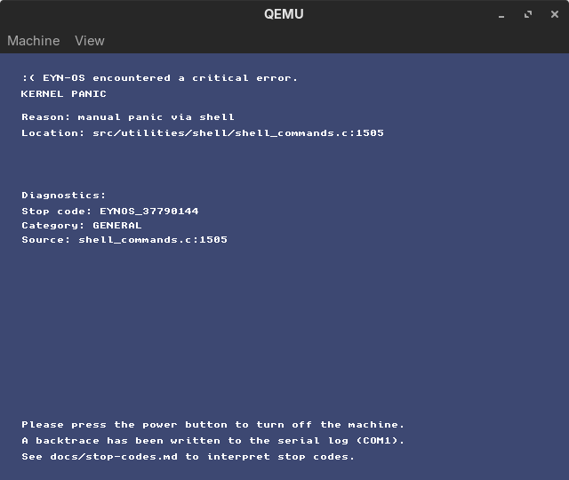

# EYN-OS Stop Codes & Debugging Guide

When a critical error occurs, EYN-OS shows a stop code like `EYNOS_5E77ABA9` on the panic screen. This document helps interpret common codes and provides comprehensive debugging guidance.

## What is a stop code?
A stop code is a 32-bit hash (FNV-1a) derived from:
- The panic message
- Source file name
- Line number

While it's not a full stack trace, **the same error location always produces the same stop code**, making it ideal for:
- Searching logs and bug reports
- Identifying recurring issues
- Tracking specific failure points

## Panic Screen Components

### Visual Layout
```
┌─────────────────────────────────────────────────────┐
│ :( EYN-OS encountered a critical error.             │
│ KERNEL PANIC                                        │
│                                                     │
│ Reason: <error description>                         │
│ Location: <file>:<line>                             │
│                                                     │
│ Diagnostics:                                        │
│   Stop code: EYNOS_XXXXXXXX                         │
│   Category: <GENERAL|ASSERT|PAGING|FILESYSTEM|IRQ>  │
│   Source: <filename>:<line>                         │
│                                                     │
│ Please press the power button to turn off.          │
│ A backtrace has been written to serial (COM1).      │
│ See docs/stop-codes.md to interpret codes.          │
└─────────────────────────────────────────────────────┘
```



### Categories
- **GENERAL**: Uncategorized or miscellaneous errors
- **ASSERT**: Assertion failure (ASSERT macro triggered)
- **PAGING**: Page fault, memory protection violation, virtual memory error
- **FILESYSTEM**: EYNFS/FAT32 driver errors, filesystem corruption
- **IRQ**: Interrupt handling errors, IDT misconfiguration

## Collecting Debug Information

### 1. Serial Output (Most Important!)
The most valuable debugging information is written to **COM1 (serial port)**:

**QEMU:**
```bash
# Run with serial output to stdout
make qemu-debug

# Or redirect to file
qemu-system-i386 -kernel kernel.bin -serial file:serial.log
```

**Output includes:**
- Full panic message
- Source file and line number
- Complete stack backtrace (up to 16 frames)
- Any prior warning messages

**Example:**
```
KERNEL PANIC: WATCHDOG: no progress for 250 ticks (last: network-poll)
At src/misc/watchdog.c:50
Backtrace:
  #00 0x001234AB
  #01 0x00105678
  #02 0x0010ABCD
  ...
```

### 2. Stop Code Hash
Calculate the stop code manually if needed:
```python
def fnv1a_stopcode(msg, file, line):
    h = 2166136261
    for c in (msg or ""): h = ((h ^ ord(c)) * 16777619) & 0xFFFFFFFF
    for c in (file or ""): h = ((h ^ ord(c)) * 16777619) & 0xFFFFFFFF
    h = ((h ^ line) * 16777619) & 0xFFFFFFFF
    return f"EYNOS_{h:08X}"
```

### 3. QEMU GDB Debugging
For live debugging:
```bash
# Terminal 1: Start QEMU with GDB support
make qemu-gdb

# Terminal 2: Connect GDB
gdb tmp/boot/kernel.bin
(gdb) target remote :1234
(gdb) continue
# Panic occurs...
(gdb) backtrace
(gdb) frame 0
(gdb) print variable_name
(gdb) x/10x $esp  # Examine stack
```

### 4. Memory Inspection
If panic occurs in memory-related code:
```bash
# In EYN-OS shell before crash:
memory stats      # Check heap status
portable stats    # Check system resources

# Post-mortem (from GDB):
(gdb) x/100x 0x00200000  # Examine heap
(gdb) info registers     # Check register state
```

## Common Error Scenarios

### ASSERT Failures

**Category**: ASSERT  
**Typical Causes**:
- Internal consistency check failed
- Unexpected state detected
- Invariant violation

**Example Messages**:
- `"Assertion failed: ptr != NULL"`
- `"heap_magic != HEAP_MAGIC"`
- `"tile_id < MAX_TILES"`

**Debugging Steps**:
1. Check the assertion expression in source
2. Examine what caused the condition to fail
3. Look at surrounding code for logic errors
4. Check if data structures are corrupted

**Common Fixes**:
- Null pointer checks missing
- Off-by-one errors in array bounds
- Race conditions in shared data
- Uninitialized variables

---

### Page Faults

**Category**: PAGING  
**Typical Causes**:
- Null pointer dereference
- Access to unmapped memory
- Write to read-only page
- Stack overflow
- Corrupted page tables

**Note**:
- EYN-OS uses demand paging and swap, so a **user-mode not-present fault can be recoverable** (e.g. demand-zero allocation, swap-in, stack growth).
- You typically only see a **PAGING stop code** when the fault is **kernel-mode** or **cannot be resolved** (protection fault with no valid recovery, reserved-bit violation, corrupted tables, etc).

**Example Messages**:
- `"Page fault at 0x00000000"` (null dereference)
- `"Page fault at 0xDEADBEEF"` (invalid pointer)
- `"Kernel panic: page fault in kernel mode"`

**Debugging Steps**:
1. Check CR2 register (fault address) from serial output
2. Determine if address is:
   - `0x00000000`: Null pointer
   - `0x00000000 - 0x00001000`: Near-null (likely null + offset)
   - `0xBFFFFFFF+`: Stack overflow
   - Other: Invalid/corrupted pointer
3. Examine backtrace to find which function dereferenced bad pointer
4. Check recent pointer assignments

**Common Fixes**:
- Add null checks: `if (!ptr) return -1;`
- Validate pointers before use
- Increase stack size for userspace
- Fix buffer overflows

---

### Filesystem Errors

**Category**: FILESYSTEM  
**Typical Causes**:
- Corrupted EYNFS/FAT32 structures
- Invalid superblock
- Bad sector reads
- Disk image not properly formatted

**Example Messages**:
- `"EYNFS magic mismatch"`
- `"Invalid FAT entry"`
- `"Sector read failed"`

**Debugging Steps**:
1. Check if disk image is valid:
   ```bash
   # Host side
   python3 devtools/fsck_eynfs.py eynfs.img
   ```
2. Verify partition table:
   ```bash
   # In EYN-OS
   fdisk
   lsata
   ```
3. Try reformatting:
   ```bash
   format 0
   ```
4. Check ATA driver status

**Common Fixes**:
- Rebuild disk images: `make eynfsimg`
- Use `fscheck` command
- Check for disk I/O errors
- Verify file operations didn't corrupt structures

---

### Watchdog Timeouts

**Category**: GENERAL  
**Message**: `"WATCHDOG: no progress for N ticks (last: <context>)"`

**Typical Causes**:
- Infinite loop without `watchdog_kick()`
- Long-running operation blocking
- Deadlock or livelock
- Interrupt storm

**Debugging Steps**:
1. Note the "last" context from message (e.g., "network-poll")
2. Find that code path in source
3. Look for loops that might run too long
4. Check if interrupt handling is stuck

**Common Fixes**:
- Add `watchdog_kick()` calls in long loops
- Break operations into smaller chunks
- Fix infinite loops
- Reduce polling frequency
- Increase watchdog timeout (if legitimately needed)

**Example Fix**:
```c
// Before (causes watchdog timeout):
while (packets_remaining) {
    process_packet();
}

// After (kicks watchdog):
while (packets_remaining) {
    watchdog_kick("packet-process");
    process_packet();
}
```

---

### IRQ/IDT Errors

**Category**: IRQ  
**Typical Causes**:
- Unhandled interrupt
- IDT not properly initialized
- Spurious interrupt
- Wrong interrupt handler

**Example Messages**:
- `"Unhandled IRQ"`
- `"IDT entry not configured"`
- `"Double fault"`

**Debugging Steps**:
1. Check which IRQ number caused fault
2. Verify IDT is initialized: `idt_init()` called
3. Check if interrupt is masked incorrectly
4. Look for EOI (End of Interrupt) missing

**Common Fixes**:
- Ensure all IRQs have handlers
- Send proper EOI to PIC
- Mask unused interrupts
- Check IRQ routing

---

### Network-Related Panics

**Typical Issues**:
- **"e1000 register access timeout"**: NIC not responding
- **"Descriptor ring corruption"**: Bad DMA setup
- **"ARP cache overflow"**: Too many ARP entries
- **"UDP queue full"**: Receive overrun

**Debugging**:
```bash
e1000 regs        # Check NIC registers
e1000 test        # Run diagnostics
e1000 udp-stats   # Check packet stats
pciscan net       # Verify e1000 detected
```

**Common Fixes**:
- Reinitialize NIC: `e1000 init`
- Clear receive queue: `e1000 udp-drain`
- Check QEMU network config
- Reduce traffic rate

---

### Ring-3 Userspace Crashes

**Typical Issues**:
- **Syscall with invalid arguments**
- **User program stack overflow**
- **Invalid ELF/UELF format**
- **Segmentation fault in user code**

**Debugging**:
```bash
ring3 yes         # Test ring-3 transition
run test.uelf     # Try simple program first
```

**Common Fixes**:
- Validate syscall arguments
- Check UELF linker script
- Verify stack allocation
- Test with known-good programs

---

## Testing Panic System

### Manual Panic Trigger
```bash
# In EYN-OS shell:
panic
```
Tests panic screen rendering and serial output.

### Assertion Test
```bash
assertfail yes
```
Triggers a deliberate assertion failure.

### Watchdog Test
Write a command that loops without kicking watchdog:
```c
while (1) {
    // No watchdog_kick() - will timeout
}
```

## Known Stop Codes

| Stop Code | Category | Description | Location | Fix |
|-----------|----------|-------------|----------|-----|
| `EYNOS_????????` | ASSERT | Heap corruption detected | `mm/heap.c` | Check for buffer overflows, double free |
| `EYNOS_????????` | PAGING | Null pointer dereference | Various | Add null checks |
| `EYNOS_????????` | WATCHDOG | Network poll timeout | `network/netstack.c` | Add watchdog kicks in loop |
| `EYNOS_????????` | IRQ | Unhandled interrupt | `cpu/isr.c` | Add handler or mask IRQ |

*Note: Actual hashes depend on source and will be populated as issues are encountered*

## Reporting Bugs

When filing a bug report, include:

1. **Stop Code**: `EYNOS_XXXXXXXX`
2. **Category**: ASSERT/PAGING/FILESYSTEM/IRQ/GENERAL
3. **Full Message**: Complete "Reason:" text
4. **Location**: File and line number
5. **Serial Backtrace**: Full output from COM1
6. **Steps to Reproduce**: Commands run before crash
7. **System Info**:
   - QEMU version or real hardware
   - Memory size (`-m 9M`, `-m 64M`, etc.)
   - Recent changes or additions
8. **Serial Log**: Attach full serial output if available

### Example Bug Report
```
Stop Code: EYNOS_A7B3C91F
Category: PAGING
Message: Page fault at 0x00000000
Location: src/network/netstack.c:145
Backtrace:
  #00 0x00103A4B
  #01 0x00105127
  #02 0x0010A889

Steps to Reproduce:
1. init
2. e1000 init
3. e1000 udp-listen 9999
4. Send packet from host with nc -u 127.0.0.1 10000
5. Crash occurs

Environment: QEMU 6.2.0, -m 9M, dev branch commit 8dac2bd
```

## Prevention Best Practices

### 1. Always Validate Pointers
```c
if (!ptr) {
    printf("%cError: null pointer\n", 255, 0, 0);
    return -1;
}
```

### 2. Kick Watchdog in Loops
```c
for (int i = 0; i < large_count; i++) {
    if (i % 100 == 0) watchdog_kick("loop-context");
    // ... work ...
}
```

### 3. Check Bounds
```c
if (index >= MAX_SIZE) {
    PANICF("Index %d exceeds maximum %d", index, MAX_SIZE);
}
```

### 4. Validate External Input
```c
// Network packet validation
if (packet_len > MAX_PACKET_SIZE || packet_len < MIN_PACKET_SIZE) {
    return -1;  // Don't panic on bad input
}
```

### 5. Use Assertions for Invariants
```c
ASSERT(heap->magic == HEAP_MAGIC);
ASSERT(descriptor_index < RING_SIZE);
```

## Additional Resources

- [general/panic.md](general/panic.md) - Panic system architecture
- [general/watchdog.md](general/watchdog.md) - Watchdog configuration and tuning
- Serial debugging tips
    - Prefer `make qemu-debug` so serial logs are captured to `tmp/qemu-debug.log`.
    - When chasing hangs, add a small periodic heartbeat on serial (or a `watchdog_kick("...")`) inside long loops.
    - If VGA output is unreliable during early boot, treat serial as the source of truth.
- GDB debugging guide
    - Use `make qemu-gdb` (QEMU starts halted and listens on `:1234`).
    - In a separate terminal: `gdb tmp/boot/kernel.bin`, then `target remote :1234`.
    - Useful commands: `continue`, `info registers`, `x/16wx $esp`, `bt`, `disassemble /m <symbol>`.
    - If you hit a triple fault/reset, set breakpoints earlier (entry + IDT setup) and step forward.

## Quick Reference Card

| Symptom | First Check | Quick Fix |
|---------|-------------|-----------|
| System hangs | Watchdog timeout? | Add `watchdog_kick()` |
| "ASSERT" panic | Check assertion | Fix logic error |
| "Page fault at 0x00000000" | Null pointer | Add null check |
| Filesystem error | Corrupt image? | Remake: `make eynfsimg` |
| Network crash | NIC initialized? | `e1000 init` |
| Random crashes | Memory corruption? | `memory stats` |
