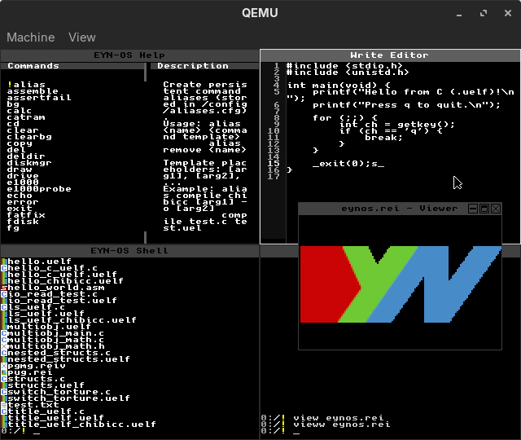

# EYN-OS System Overview

EYN-OS is a freestanding x86 operating system designed with the philosophy of "reinventing the wheel" - building everything from scratch to understand and control every aspect of the system (within reason).

## Architecture Overview

### Beginner's Guide: How EYN-OS Works
Think of EYN-OS as a custom-built house. Instead of buying pre-made rooms (libraries like `libc`), we built every brick ourselves.
- **The Foundation (Kernel)**: The core program that talks to the hardware.
- **The Butler (Shell)**: Takes your commands and tells the Kernel what to do.
- **The Rooms (Memory)**: Where programs live and work.

### System Architecture Diagram
```
┌──────────────────────────────────────────────────────────────┐
│                       User Applications                      │
│           (Shell, Text Editor, Games, Utilities)             │
└──────────────┬──────────────────────────────┬────────────────┘
               │                              │
┌──────────────▼──────────────┐┌──────────────▼────────────────┐
│      System Call API        ││      Tiling / GUI Manager     │
└──────────────┬──────────────┘└──────────────┬────────────────┘
               │                              │
┌──────────────▼──────────────────────────────▼────────────────┐
│                        Kernel Core                           │
│  ┌─────────────┐  ┌─────────────┐  ┌──────────────────────┐  │
│  │  Scheduler  │  │     VMM     │  │  Filesystem (VFS)    │  │
│  └─────────────┘  └─────────────┘  └──────────────────────┘  │
└──────────────┬──────────────────────────────┬────────────────┘
               │                              │
┌──────────────▼──────────────────────────────▼────────────────┐
│                      Hardware Drivers                        │
│    (VGA, Keyboard, ATA Disk, Serial, Timer, Interrupts)      │
└──────────────────────────────────────────────────────────────┘
```


### Target Platform
- **Architecture**: Intel x86 (32-bit, i386 or higher)
- **Bootloader**: GRUB (Multiboot 1.0 compliant)
- **Memory Model**: Flat memory model with optional paging/virtual memory
- **Privilege Separation**: Ring 0 (kernel) and Ring 3 (userspace) with syscall interface
- **Target Hardware**: Low-end systems (9MB RAM minimum)
- **ISO Size**: ~8-10MB (includes EYNFS disk image)

### Core Design Principles
1. **Freestanding Environment**: No dependency on standard C libraries
2. **From-Scratch Implementation**: Custom implementations of all system components
3. **Educational Focus**: Clear, understandable code for learning purposes
4. **Modular Design**: Well-separated components for maintainability
5. **Stability & Security**: Robust error handling and graceful failure recovery
6. **Extreme Portability**: Optimized for systems with minimal RAM

## System Components

### Kernel Core
- **Boot Process**: GRUB → Kernel entry point → System initialization
- **Memory Management**: Advanced heap management with corruption detection
- **Interrupt Handling**: Intelligent exception handling with recovery mechanisms
- **Device Drivers**: VGA, keyboard, ATA disk controller

### Stability & Security Features
- **Exception Recovery**: Intelligent ISR handlers that attempt recovery instead of halting
- **Memory Protection**: Heap corruption detection, stack overflow protection
- **Command Safety**: Input validation, argument sanitization, injection prevention
- **Process Isolation**: Memory separation between kernel and user programs
- **Error Logging**: Comprehensive error tracking and reporting system

### Memory Management
- **Dynamic Heap Sizing**: Adaptive memory allocation based on available RAM
- **Corruption Detection**: Magic numbers, checksums, and block validation
- **Best-Fit Allocation**: Efficient memory allocation strategy
- **Memory Leak Detection**: Tracking of allocation and free operations
- **Conservative Limits**: Prevents excessive memory usage on low-end systems

### Filesystem Layer
- **EYNFS**: Native filesystem with custom design
- **MBR Partitioning**: Support for partitioned disks (primary partitions)
- **FAT32 Support**: Read/write compatibility with FAT32 filesystems
- **VFS Layer**: Virtual filesystem abstraction (`vfs_*` API)
- **File Operations**: Read, write, create, delete, directory traversal
- **Dynamic Buffering**: Adaptive file reading with up to 64KB buffers
- **Multiple Drives**: Support for switching between ATA drives (`drive` command)

### User Interface
- **TUI Framework**: Text-based user interface system
- **Shell System**: Command-line interface with streaming command architecture
- **Help System**: Interactive documentation viewer with dual-pane layout
- **File Rendering**: Support for REI images and Markdown formatting

#### Fonts and text rendering

EYN-OS renders text using a bitmap **system font** provided by the VGA driver.

- Default system font path: `/fonts/unscii-16.hex` (8×16)
- Fonts live in the EYNFS image under `/fonts/` (the build tooling copies the repository `fonts/` directory into the disk image)
- The active system font can be switched at runtime via the `setfont` shell command (see docs/command-reference.md)

Important limitation: most UI/terminal code renders **bytes (0–255)** as glyph indices. Unicode-indexed `.hex` fonts are supported for loading, but full Unicode text rendering/mapping is not yet implemented.

### Development Tools
- **Assembler**: Built-in NASM-compatible assembler for assembly development
- **C Compiler**: Integrated chibicc compiler for C development (C11 compliant)
- **Executable Formats**: 
  - Native flat binaries (`.eyn`)
  - UELF format (`.uelf`) - ELF32-based ring-3 userspace programs
- **Program Loader**: Ring-3 execution with syscall interface (int 0x80)
- **Userland Support**: Full C runtime (`crt0.S`), syscalls, stdio
- **Linker**: Custom linker for UELF programs (`devtools/user_elf32.ld`)

### Applications
- **Game Engine**: Framework for built-in games (Snake, Maze Runner)
- **Text Editor**: Write editor for file editing
- **Utilities**: Math functions, search, sort, random number generation
- **File Operations**: Copy, move, and advanced file management

## File Structure

```
EYN-OS/
├── src/
│   ├── boot/           # Bootloader and kernel entry
│   ├── cpu/            # CPU management (IDT, ISRs)
│   ├── drivers/        # Hardware drivers
│   ├── entry/          # Kernel main entry point
│   └── utilities/      # System utilities and applications
├── include/            # Header files
├── docs/              # Documentation (this directory)
├── testdir/           # Test files and game data
└── Makefile           # Build system
```

## Build System

### Compilation
- **Compiler**: GCC with freestanding flags
- **Linker**: Custom linker script for proper memory layout
- **Target**: ELF32 binary for GRUB compatibility

### Key Build Flags
```bash
-m32                    # 32-bit x86 target
-ffreestanding         # No standard library
-fno-stack-protector   # Disable stack protection
-Oz                    # Optimize for size
```

## Memory Layout

### Beginner's Guide: The Memory Map
Imagine the computer's RAM as a long street with addresses from 0 to 4,294,967,295 (4GB).
- **Low Addresses (0 - 1MB)**: Reserved for hardware and the Kernel code. "Restricted Area".
- **Middle Addresses**: Where the Kernel stores its data (Heap).
- **High Addresses**: Where User programs live (if Paging is on).

### Physical Memory Map
```
0xFFFFFFFF ┌──────────────────────┐
           │                      │
           │   Free RAM / Heap    │
           │                      │
0x00200000 ├──────────────────────┤
           │   Kernel Heap Start  │
0x00100000 ├──────────────────────┤
           │   Kernel Code/Data   │
0x00000000 └──────────────────────┘
```

### Virtual Memory Map (When Paging Enabled)
```
0xFFFFFFFF ┌──────────────────────┐
           │   Recursive Mapping  │
0xC0000000 ├──────────────────────┤
           │   Kernel Space       │
           │ (Mapped to Physical) │
0xBFFFFFFF ├──────────────────────┤
           │   User Stack         │
           │      (Grows Down)    │
           │                      │
           │   User Heap          │
           │      (Grows Up)      │
0x00400000 ├──────────────────────┤
           │   User Code          │
0x00000000 └──────────────────────┘
```

## Hardware Support

### Supported Devices
- **VGA**: Text mode display (80x25 characters) with bitmap font rendering
- **PS/2 Keyboard**: Full keyboard input with command-line editing
- **PS/2 Mouse**: Mouse support for GUI/tiling manager
- **ATA/IDE**: Hard disk and CD-ROM access with DMA support
- **Intel e1000**: Network interface card (82540EM and compatible)
- **Serial**: Debug output and logging (COM1)
- **PCI**: Device enumeration and configuration

### Memory Requirements
- **Minimum**: 9MB RAM (QEMU default: `-m 9M`)
- **Debug/Development**: 64MB RAM (`make qemu-gdb` uses `-m 64M`)
- **Note**: Memory budget is intentionally kept small; system uses fixed/stack buffers and streaming commands to operate efficiently

## Streaming Command Architecture

### Essential Commands
Always available in RAM for core functionality:
- `init`, `ls`, `exit`, `clear`, `help`
- `memory`, `portable`, `load`, `unload`, `status`

### Streaming Commands
Loaded on-demand to conserve memory:
- Filesystem: `format`, `fdisk`, `fscheck`, `copy`, `move`, `del`
- Basic: `echo`, `ver`, `calc`, `search`, `drive`, `read`, `write`
- Advanced: `random`, `history`, `sort`, `game`, `draw`
- Subcommands: Various specialized command variants

## Development Philosophy

### Why "Reinvent the Wheel"?
1. **Learning**: Understanding how everything works
2. **Control**: Full control over system behavior
3. **Simplicity**: No unnecessary complexity
4. **Customization**: Tailored to specific needs

### Code Style
- **Clear Comments**: Extensive documentation in code
- **Simple Functions**: One function, one purpose
- **Consistent Naming**: Descriptive function and variable names
- **Error Handling**: Graceful error recovery where possible
- **Professional Output**: Clean, informative user messages

## Networking

### Network Stack
- **Driver**: Intel e1000 NIC driver (MMIO-based, descriptor rings)
- **Link Layer**: Ethernet frame handling (send/receive)
- **ARP**: Address Resolution Protocol for MAC/IP mapping
- **IPv4**: Basic IPv4 packet handling (no fragmentation yet)
- **UDP**: Full UDP socket-like interface for userspace
- **Statistics**: Per-protocol statistics (`e1000 udp-stats`, `e1000 udp-drain`)

### Network Commands
- `e1000 probe|init|regs|test` - NIC diagnostics and initialization
- `e1000 udp-listen|udp-send|udp-echo|udp-stats|udp-drain` - UDP utilities
- `ping <dst_ip> [count] [local_ip]` - ICMP echo
- `netstat` - Network status
- `netcfg show|defaults|set|save|load ...` - Network config (runtime + persisted)
- `pciscan [net]` - Enumerate PCI devices

## Robustness Features

### Watchdog Timer
- **Purpose**: Detect and recover from kernel hangs
- **Implementation**: IRQ-based with configurable timeout
- **Usage**: Long loops must kick watchdog (`watchdog_kick("context")`)
- **Documentation**: [docs/general/watchdog.md](general/watchdog.md)

### Panic System
- **Stop Codes**: Unique identifiers for each panic condition (e.g., `EYNOS_00000001`)
- **Stack Traces**: Automatic backtrace via serial output (frame pointers preserved)
- **Recovery**: Some ISRs attempt intelligent recovery before panicking
- **Documentation**: [docs/stop-codes.md](stop-codes.md)

### Memory Protection
- **Heap Guards**: Magic numbers and checksums for corruption detection
- **Bounds Checking**: Validation of memory operations
- **Ring-3 Isolation**: User programs run in protected mode with limited privileges
- **Stack Canaries**: Protected return addresses in critical paths

## Recent Developments (Last 3 Months)

- **Networking** (Jan 2026): UDP/IPv4 stack, e1000 NIC driver, ARP support
- **Compiler** (Jan 2026): Integrated chibicc for on-system C development
- **Userland** (Dec 2025): Ring-3 separation, UELF format, syscalls, full C runtime
- **Aliases** (Jan 2026): Persistent command aliases with parameter substitution
- **Window Resizing** (Jan 2026): Dynamic window sizing in tiling manager
- **REIV Format** (Dec 2025): Video/GIF playback support (MP4→REIV converter)
- **Theme Customization** (Jan 2026): Customizable tiling manager colors and fonts
- **Watchdog** (Dec 2025): Hang detection and recovery system
- **Partitioning** (Dec 2025): MBR partition support, multi-partition disk images
- **PCI Enumeration** (Dec 2025): Device scanning and identification
