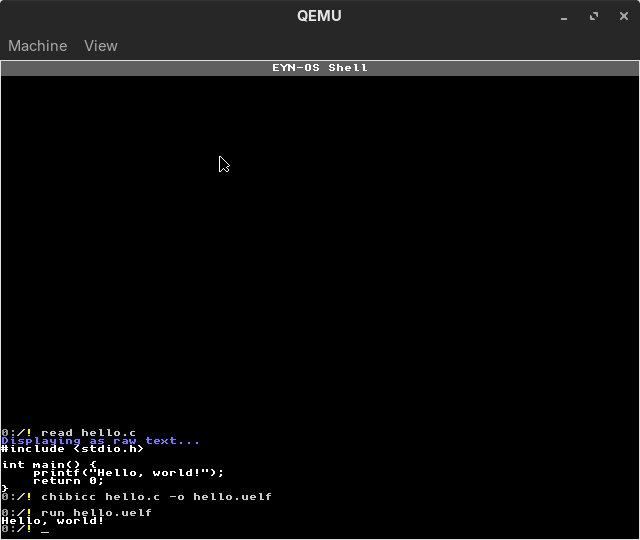

# Chibicc C Compiler Integration

EYN-OS includes an integrated port of [chibicc](https://github.com/rui314/chibicc), a small but capable C11 compiler, enabling on-system C development.

## Overview

**Directory**: `chibicc-main/`  
**Command**: `chibicc` (available as shell command after `load`)  
**Target**: i386 UELF executables for ring-3 userspace  
**Standard**: C11 (most features supported)

## Usage

### Basic Compilation
```bash
# Compile single source file
chibicc hello.c -o hello.uelf

# Run the compiled program
run hello.uelf
```

### Multiple Source Files
```bash
# Compile and link multiple files
chibicc main.c utils.c -o program.uelf
```

### Compiler Options
```bash
chibicc --help              # Show help
chibicc -S file.c           # Generate assembly (i386)
chibicc -c file.c           # Compile to object file
chibicc -o output file.c    # Specify output file
chibicc -I/path file.c      # Add include path
chibicc -D MACRO file.c     # Define macro
```

## Integration Details

### Build Process
Chibicc is compiled as a native x86 binary and included in the EYNFS disk image:
- Host build: `make -C chibicc-main` (produces `chibicc`)
- Copied to: `testdir/chibicc.uelf`
- Available in-OS at: `/chibicc.uelf`

### Toolchain Components
1. **Preprocessor**: Full C preprocessor with macros, includes, conditionals
2. **Compiler**: C to i386 assembly code generation
3. **Assembler**: Integrated (generates object code)
4. **Linker**: Custom EYN-OS linker for UELF format

### Output Format
Chibicc generates **UELF** (userland ELF) executables:
- ELF32 format with specific conventions
- Linked for ring-3 execution at `0x00400000`
- Uses `crt0.S` startup code from `userland/`
- Syscall interface via `int 0x80`

See [api/userland-uelf-abi.md](../api/userland-uelf-abi.md) for format details.

## Supported Features

### Language Features
- Most C11 syntax and semantics
- Structs, unions, enums
- Pointers and arrays
- Function pointers
- Type qualifiers (const, volatile)
- Floating point (basic)
- Variadic functions
- _Thread_local (basic support)
- Some C11 library features (limited libc)

### Standard Library
Limited libc available in `userland/libc/`:
- `stdio.h`: printf, putchar, getchar (syscall-based)
- `string.h`: memcpy, memset, strlen, strcmp, etc.
- `stdlib.h`: malloc, free, exit (minimal)
- `stdint.h`: uint8_t, uint32_t, etc.

No full C standard library; focus on kernel syscalls.

## Example Programs

### Hello World
```c
// hello.c
#include <stdio.h>

int main(int argc, char** argv) {
    printf("Hello from chibicc!\n");
    return 0;
}
```

Compile and run:
```bash
chibicc hello.c -o hello.uelf
run hello.uelf
```



### Using Syscalls
```c
// syscall_demo.c
#include <eynos_syscall.h>

int main() {
    const char* msg = "Direct syscall!\n";
    // Syscall 1 = write(fd, buf, len)
    syscall3(1, 1, (uint32)msg, 16);
    return 0;
}
```

### GUI Application
```c
// gui_demo.c
#include <eynos_syscall.h>

int main() {
    // Syscall to create GUI tile
    uint32 tile_id = syscall1(100, 0);  // Create tile
    
    // Draw pixels
    for (int y = 0; y < 100; y++) {
        for (int x = 0; x < 100; x++) {
            // Pixel syscall: tile, x, y, r, g, b
            syscall6(101, tile_id, x, y, 255, 0, 0);
        }
    }
    
    return 0;
}
```

### Building DOOM inside EYN-OS

EYN-OS also includes an in-OS build path for the DOOM port:

```bash
build_doom
doom_chibicc
```

The `build_doom` script drives chibicc in two phases:

1. Compile `/DOOM/doom_unity.c` to assembly.
2. Assemble and link that assembly into `/binaries/doom_chibicc`.

This is primarily a demonstration of the userland toolchain, shell scripting,
filesystem integration, and low-memory process model working together.

## Limitations

### Compiler Limitations
- **No optimization**: Code is not optimized (size/speed)
- **Simple codegen**: Straightforward but not efficient
- **Limited diagnostics**: Basic error messages
- **No debuginfo**: No DWARF symbols for debugging

### Runtime Limitations
- **Minimal libc**: Many standard functions unavailable
- **No stdio files**: No `fopen`, `fread`, etc. (use syscalls)
- **No malloc**: Heap allocation limited or unavailable
- **Single process**: No fork, exec, threads

For larger builds, remember that EYN-OS is still a low-RAM environment.
Large translation units and macro-heavy code are supported, but compile times
and paging pressure are materially higher than on a host machine.

### Platform Limitations
- **32-bit only**: No 64-bit support
- **i386 target**: No SSE, AVX, etc.
- **Ring-3 only**: Cannot access kernel memory/ports
- **Static linking**: No dynamic libraries

## Userland Development

### Project Structure
```
testdir/
├── hello_c_uelf.c          # Example C program
├── hello_c_uelf.uelf       # Compiled UELF
├── gui_demo_uelf.c         # GUI example
└── ls_uelf.c               # Userland ls clone
```

### Build Scripts
Host-side scripts in `devtools/`:
- `build_user_c.sh`: Compile with host GCC
- `build_user_c_chibicc.sh`: Compile with chibicc
- `build_user_chibicc_uelf.sh`: Full chibicc + UELF pipeline

### Syscall Interface
Header: `userland/eynos_syscall.h`

```c
// Syscall wrappers
static inline uint32 syscall1(uint32 n, uint32 a1);
static inline uint32 syscall2(uint32 n, uint32 a1, uint32 a2);
static inline uint32 syscall3(uint32 n, uint32 a1, uint32 a2, uint32 a3);
// ... up to syscall6

// Convenience functions
void sys_write(int fd, const void* buf, size_t len);
void sys_exit(int code);
int sys_read(int fd, void* buf, size_t len);
```

See [api/syscalls.md](../api/syscalls.md) for available syscalls.

## Compilation Pipeline

### In-OS Compilation
```
Source (.c) → chibicc → Assembly (.s) → UELF (.uelf)
                ↓
           Linker (built-in)
                ↓
           crt0.S + libc
                ↓
         Ring-3 executable
```

### Host Compilation (Cross)
```
Source (.c) → GCC -m32 → Object (.o) → UELF
                          ↓
                    user_elf32.ld
```

Both produce compatible UELF binaries.

## Testing

Example programs in `testdir/`:
- `hello_chibicc.uelf`: Hello world
- `cat_uelf_chibicc.uelf`: Simple cat implementation
- `ls_uelf_chibicc.uelf`: Directory listing
- `gui_demo_uelf_chibicc.uelf`: GUI demonstration
- `title_uelf_chibicc.uelf`: Set window title

Run any with: `run <filename>.uelf`

## Troubleshooting

### "chibicc: command not found"
Run `load` to load streaming commands including chibicc.

### "Compilation failed"
Check syntax errors. Chibicc provides basic error messages but not as detailed as GCC/Clang.

### "Large builds stall or are slow"
This is usually memory-pressure related rather than a parser bug.  EYN-OS now
supports much larger chibicc workloads than before, but big unity builds such
as DOOM still exercise demand paging, swap, and filesystem I/O heavily.

### "Program crashes on run"
- Check stack usage (limited stack space)
- Verify syscall numbers (see syscalls.md)
- Ensure return type matches (int main)
- Check for NULL pointer dereferences

### "Undefined reference to..."
Missing function from libc or wrong syscall usage. Check `userland/libc/` for available functions.

## Future Enhancements

- **Optimization passes**: Basic peephole optimization
- **Better diagnostics**: Improved error messages with line numbers
- **More libc**: Expand standard library coverage
- **Dynamic linking**: Shared library support
- **Debugger**: GDB-compatible debugging
- **Faster compilation**: Optimize compiler itself

## References

- [Chibicc upstream](https://github.com/rui314/chibicc)
- [UELF ABI specification](../api/userland-uelf-abi.md)
- [Syscall documentation](../api/syscalls.md)
- [Example programs](../../testdir/)

## Related Files

| Path | Purpose |
|------|---------|
| `chibicc-main/` | Chibicc source code |
| `userland/` | C runtime and libc |
| `userland/eynos_syscall.h` | Syscall interface |
| `devtools/user_elf32.ld` | Linker script for UELF |
| `src/cpu/user_elf.c` | UELF loader in kernel |
| `testdir/*.uelf` | Example programs |
