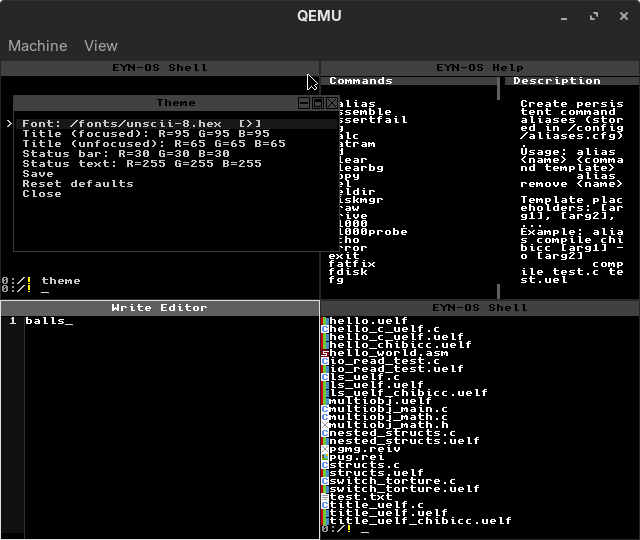

# Tiling Manager and Floating Windows

The EYN-OS GUI layer combines a tiling front-end with a floating window manager. This page describes the architecture and APIs for building GUI apps that render inside tiles or windows.

## Overview



### Screen Layout
EYN-OS uses a tiling window manager. Windows are arranged in a grid rather than overlapping freely.

- **Tiles**: Up to 4 work areas that split the screen evenly. Each tile hosts a virtual terminal and optionally a GUI client.
- **Floating Windows**: Chrome-decorated windows that sit on top of the tiles and can be freely dragged and resized.
- **Taskbar**: A bottom bar with a start menu, running program list, and clock.

```
┌───────────────────────────────┬───────────────────────────────┐
│ Tile 1 (Top Left)             │ Tile 2 (Top Right)            │
│                               │                               │
│   ┌───────────────────────┐   │                               │
│   │ Floating Window       │   │                               │
│   │ (drag titlebar/edges) │   │                               │
│   └───────────────────────┘   │                               │
│                               │                               │
├───────────────────────────────┼───────────────────────────────┤
│ Tile 3 (Bottom Left)          │ Tile 4 (Bottom Right)         │
│                               │                               │
│                               │                               │
│                               │                               │
└───────────────────────────────┴───────────────────────────────┘
│ [Start]  program1  program2              Mon 03 Mar  12:34     │
└───────────────────────────────────────────────────────────────┘
```

## Architecture

### Source Layout

The GUI compositor lives entirely in `src/gui/`. It is built as a **unity build** -- a single compilation unit (`tiling_manager.c`) that `#include`s the sub-modules in dependency order. This keeps all state file-scoped while making each concern easy to navigate and contribute to independently.

| File | Lines | Responsibility |
|---|---|---|
| `src/gui/tiling_manager.c` | entry point | Preamble, `#include` chain, main compositor loop |
| `src/gui/gui_state.c` | ~780 | Shared globals, types, constants, inline helpers |
| `src/gui/gui_wm.c` | ~1010 | Floating window chrome, drag/resize, `wm_*` API |
| `src/gui/gui_tiles.c` | ~690 | Tile layout, decoration, lifecycle |
| `src/gui/gui_taskbar.c` | ~520 | Taskbar, start menu, clock |
| `src/gui/gui_input.c` | ~1140 | Tile public API, ring-3 input pump |

Adding a sub-module: create `src/gui/gui_<name>.c` with a brief description comment block, `#include` it in `tiling_manager.c` at the right dependency position, and do **not** add it as a separate Makefile target.

```
┌───────────────────────────────┐
│            Apps               │
│  (view, draw, edit, files…)   │
├───────────────────────────────┤
│  GUI compositor               │
│  src/gui/tiling_manager.c     │
│  ├── gui_state.c              │
│  ├── gui_wm.c                 │
│  ├── gui_tiles.c              │
│  ├── gui_taskbar.c            │
│  └── gui_input.c              │
├───────────────────────────────┤
│  Virtual Terminals            │
│  src/utilities/tui/terminals.c│
├───────────────────────────────┤
│  VGA + Mouse Drivers          │
│  (dirty rects, cursor, wheel) │
└───────────────────────────────┘
```

Key headers:
- `include/utilities/tile_manager.h` -- full kernel-side API
- `userland/include/gui.h` -- userland GUI API (ring-3 programs)
- `include/utilities/terminals.h` -- virtual terminal API

## Tile GUI API

Header: `include/utilities/tile_manager.h`

```c
// Create a new GUI tile; returns tile index or -1 if no free slot
int tile_create_gui_tile(const char* title, const char* status_left);

// Register GUI client callbacks (tile takes ownership until unregistered)
typedef void (*tile_gui_draw_cb)(int tile_idx, int x, int y, int w, int h, void* ud);
typedef void (*tile_gui_key_cb)(int tile_idx, int key, void* ud);
typedef void (*tile_gui_mouse_cb)(int tile_idx, const mouse_event_t* me, void* ud);

// Return 1 to allow close, 0 to veto (program handles cleanup and calls exit)
typedef int (*tile_gui_close_cb)(int tile_idx, void* ud);

void tile_register_gui_client2(int tile_idx,
    tile_gui_draw_cb draw,
    tile_gui_key_cb key,
    tile_gui_mouse_cb mouse,
    void* userdata);

void tile_register_gui_close_cb(int tile_idx, tile_gui_close_cb close_cb);
void tile_unregister_gui_client(int tile_idx);

// Title/status and redraw
void tile_set_title_status(int tile_idx, const char* title, const char* left, const char* right);
void tile_invalidate_gui(int tile_idx);
void tile_invalidate_decorations(int tile_idx);

// Enable every-frame redraw (animation/video; subject to global FPS cap)
void tile_set_gui_continuous_redraw(int tile_idx, int enabled);

// Content rect in screen pixels (excludes title/status/borders)
void tile_get_content_rect(int tile_idx, int* out_x, int* out_y, int* out_w, int* out_h);

// Close a tile and repack remaining tiles
void tile_close(int tile_idx);
```

### Userland GUI fast blit

For ring-3 programs that need full-frame software rendering, use the RGB565 blit via `gui_blit_rgb565()`. This copies a user-provided RGB565LE buffer into the kernel and optionally scales it to the tile content size.

```c
typedef struct {
    int src_w, src_h;
    const uint16_t* pixels; // RGB565LE
    int dst_w, dst_h;        // <=0 means use content size
} gui_blit_rgb565_t;

int gui_blit_rgb565(int handle, const gui_blit_rgb565_t* cmd);
```

### Icons

Draw a named file-type icon from the kernel icon cache:

```c
// Kernel side
void tile_draw_file_icon(const char* icon_name, int x, int y);

// Userland (gui.h)
typedef struct { int x, y; const char* icon_name; } gui_icon_t;
int gui_draw_icon(int handle, const gui_icon_t* cmd);
```

Icons are loaded from `/icons16/` (falling back to `/icons/`) and cached. `icon_name` is a base name like `"file_c"`, `"dir_empty"`, `"file_none"`.

## Floating Window API

```c
// Create a floating window; returns win_id (>=0) or -1
int wm_create_window(const char* title, int x, int y, int w, int h, const char* status_left);

// Register callbacks (same types as tile API)
void wm_register_gui_client2(int win_id,
    tile_gui_draw_cb draw,
    tile_gui_key_cb key,
    tile_gui_mouse_cb mouse,
    void* userdata);

void wm_register_gui_close_cb(int win_id, tile_gui_close_cb close_cb);
void wm_unregister_gui_client(int win_id);

// Decorations and redraws
void wm_set_title_status(int win_id, const char* title, const char* left, const char* right);
void wm_invalidate_window(int win_id);
void wm_set_continuous_redraw(int win_id, int enabled);

// Content rect in screen pixels
void wm_get_content_rect(int win_id, int* cx, int* cy, int* cw, int* ch);

// Close the window
void wm_close_window(int win_id);
```

Windows have a title bar (drag to move), resize handles on all edges and corners, and close/maximise/minimise buttons. Titlebar icons are loaded from `testdir/ui/*.rei` assets.

### Drag and resize

Both floating windows and tile windows support interactive drag and resize:

- **Floating windows**: grab the titlebar to move; grab any edge or corner to resize.
- **Tile windows**: grab the titlebar to reposition within the desktop; grab edges/corners to resize. `layout_tiles()` only auto-recalculates tiles that have not been manually moved.

Resize operates on all eight hit zones (4 edges + 4 corners). The cursor changes to the appropriate resize variant while hovering.

These interactions are pumped both in the main compositor loop and inside `tile_pump_input_once()`, so they remain responsive while a ring-3 task is running.

## Userland GUI API (`userland/include/gui.h`)

Ring-3 programs use the high-level `gui.h` wrappers instead of calling syscalls directly.

### Immediate-mode drawing

```c
int gui_begin(int handle);                          // start a frame
int gui_clear(int handle, const gui_rgb_t* rgb);    // fill content area
int gui_fill_rect(int handle, const gui_rect_t* r); // filled rectangle
int gui_outline_rect(int handle, const gui_rect_t*);// 1-pixel border, no fill
int gui_draw_line(int handle, const gui_line_t* l); // line between two points
int gui_draw_text(int handle, const gui_text_t* t); // string at pixel pos
int gui_draw_char(int handle, const gui_char_t* c); // single character
int gui_draw_icon(int handle, const gui_icon_t* i); // named icon from cache
int gui_present(int handle);                        // submit frame to screen
```

### Layout helpers

```c
int gui_get_content_size(int handle, gui_size_t* out);  // content area size
int gui_get_font_metrics(int handle, gui_font_metrics_t* out); // char w/h
int gui_set_font(int handle, const char* font_path);    // .hex/.otf/.ttf, NULL resets to kernel font
int gui_load_font(int handle, const char* font_path);   // returns font id [1..8]
int gui_draw_text_font(int handle, const gui_text_font_t* t); // text with specific font id
int gui_draw_char_font(int handle, const gui_char_font_t* c); // char with specific font id
int gui_set_continuous_redraw(int handle, int enabled); // animation mode
```

### Events

```c
int gui_poll_event(int handle, gui_event_t* out);  // returns 1, 0, or -1
int gui_wait_event(int handle, gui_event_t* out);  // blocks until event

typedef struct {
    unsigned int type; // GUI_EVENT_NONE/KEY/MOUSE/CLOSE
    int a, b, c, d;
} gui_event_t;
```

Key codes are defined in `gui.h` as `GUI_KEY_*` constants. Modified keys OR the base code with `GUI_KEY_SHIFT`, `GUI_KEY_CTRL`, or `GUI_KEY_SUPER`. For example, Shift+Up is `GUI_KEY_UP | GUI_KEY_SHIFT`.

### Creating a window

```c
// gui_create()  -- creates a new tile
// gui_attach()  -- attaches to the calling task's existing tile (preferred for
//                  ring-3 programs so focus-switching works while the task runs)
int gui_create(const char* title, const char* status_left);
int gui_attach(const char* title, const char* status_left);
int gui_set_title(int handle, const char* title);
```

## Virtual Terminals

Header: `include/utilities/terminals.h`

- One vterm per tile, with scrollback
- Mouse wheel scrolls the vterm when no GUI client is registered on that tile
- Selection visuals are supported on the input line

```c
void vterm_handle_key(int idx, int key);
void vterm_set_scroll(int idx, int scroll);
int  vterm_get_version(int idx); // content version for incremental redraw
```

## Theming

The title bar and status bar colours are runtime-configurable via:

```c
typedef struct {
    uint8 title_focused_r,   title_focused_g,   title_focused_b;
    uint8 title_unfocused_r, title_unfocused_g, title_unfocused_b;
    uint8 status_r, status_g, status_b;
    uint8 status_text_r, status_text_g, status_text_b;
} wm_theme_t;

void wm_theme_get(wm_theme_t* out);
void wm_theme_set(const wm_theme_t* in);
void wm_theme_reset_defaults(void);
```

The `theme` shell command provides an interactive picker.

## Commands

| Command | Description |
|---|---|
| `tiling` | Launch the tiling manager UI |
| `view <file.rei>` | Open an image viewer in a floating window |
| `draw` | Open a canvas editor in a floating window |
| `edit <file>` | Open the text editor in a floating window |
| `files` | Open the file manager |
| `kwin_test` | Open a compositor test window |
| `setbg <file.rei>` | Set background image for the focused tile (Tile/Scale/Center chooser) |
| `clearbg` | Remove the background for the focused tile |
| `setfont <file.hex|file.otf|file.ttf>` | Load a system font |
| `theme` | Interactive theme (title bar colour) picker |
| `stats` / `kstats` | Show system stats overlay |

## Input

- **Keyboard**: routed to the focused tile or window; `Ctrl+X` closes most GUI programs
- **Mouse**: click-to-focus; drag titlebar to move; drag edges/corners to resize; wheel scrolls vterm
- **Cursor**: REI image overlay loaded from `testdir/ui/cursor.rei`

## Performance

- The compositor uses dirty-rectangle tracking and back-buffer pixel ops to reduce flicker.
- Draw only within the provided content rect; avoid full-screen clears.
- For very slow machines, the tiler supports a low-quality mode with wireframe drag outlines.

### Runtime tuning

```c
// Mode: 0=high, 1=low (wireframe drag), 2=auto (based on detected RAM)
void tiler_gui_set_mode(int mode);
// FPS cap; 0 = unlimited
void tiler_gui_set_fps_cap(int fps);
// Milliseconds to skip redraws while dragging (0 = minimal throttle)
void tiler_gui_set_drag_throttle_ms(int ms);
// Print current settings to shell
void tiler_gui_print_status(void);
```

### Per-tile background images

```c
// Interactive chooser; takes ownership of image memory
int tile_begin_set_background_from_rei(int tile_idx, rei_image_t* image);
void tile_clear_background(int tile_idx);
```

## Examples

### Minimal kernel-side tile app

```c
static void app_draw(int t, int x, int y, int w, int h, void* ud) {
    drawRect(x, y, w, h, 0, 0, 0);
    const char* msg = "Hello Tile";
    const int cw = vga_text_cell_w();
    for (int i = 0; msg[i]; ++i)
        drawCharAt(x + 4 + i * cw, y + 4, (unsigned char)msg[i], 255, 255, 0);
}

static void app_key(int t, int key, void* ud) {
    if (key == GUI_KEY_CTRL_X) tile_unregister_gui_client(t);
}

int t = tile_create_gui_tile("Demo", "Ctrl+X: Close");
tile_register_gui_client2(t, app_draw, app_key, NULL, NULL);
```

### Minimal ring-3 GUI program

```c
#include <gui.h>

int main(void) {
    int h = gui_attach("Demo", "q: quit");
    gui_size_t sz;
    gui_get_content_size(h, &sz);

    for (;;) {
        gui_begin(h);
        gui_rgb_t bg = {20, 20, 40, 0};
        gui_clear(h, &bg);

        gui_text_t t = {10, 10, 255, 255, 0, 0, "Hello ring-3"};
        gui_draw_text(h, &t);
        gui_present(h);

        gui_event_t ev;
        gui_wait_event(h, &ev);
        if (ev.type == GUI_EVENT_KEY && ev.a == 'q') break;
        if (ev.type == GUI_EVENT_CLOSE) break;
    }
    return 0;
}
```

To tune performance on low-spec machines:

```c
tiler_gui_set_mode(2);              // auto-select high/low based on RAM
tiler_gui_set_fps_cap(30);
tiler_gui_set_drag_throttle_ms(33); // ~30Hz drag updates
```

## Font metrics

Do not assume an 8×8 font. Query the active font size:

```c
// Kernel side
int cw = vga_text_cell_w();
int ch = vga_text_cell_h();

// Userland (gui.h)
gui_font_metrics_t m;
gui_get_font_metrics(handle, &m);
// m.char_w, m.char_h
```

Use `setfont` to load a `.hex`, `.otf`, or `.ttf` font system-wide. Pass `NULL` to `gui_set_font()` to reset to the kernel default.

## Multiple fonts in one window

Applications can mix multiple fonts in a single GUI handle:

1. Set a default window font with `gui_set_font()`.
2. Load extra fonts once with `gui_load_font()` and store returned font ids.
3. Use `gui_draw_text_font()` / `gui_draw_char_font()` per draw call.
4. Pass `font_id = 0` to use the default window font.

Example:

```c
int h = gui_attach("Font Mix", NULL);
gui_set_font(h, "/fonts/unscii-16.otf@16");
int title_font = gui_load_font(h, "/fonts/unscii-16.otf@24");

gui_begin(h);
gui_clear(h, &(gui_rgb_t){30, 30, 30, 0});

gui_text_font_t title = { title_font, 8, 8, 220, 220, 220, 0, "Header" };
gui_draw_text_font(h, &title);

gui_text_font_t body = { 0, 8, 40, 180, 200, 255, 0, "Body text using default font" };
gui_draw_text_font(h, &body);

gui_present(h);
```

